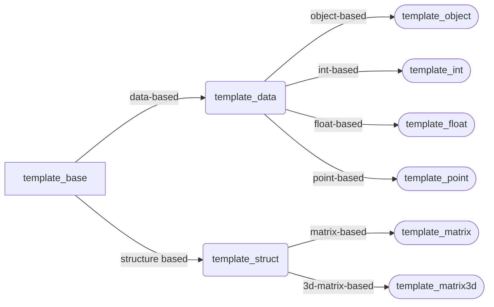

# cgraph
________

A C library for graph and mathematical analysis

```shell
                                                _                               
                                               | |                              
                       ___ __ _ _ __ __ _ _ __ | |__                            
                      / __/ _` | '__/ _` | '_ \| '_ \                           
                     | (_| (_| | | | (_| | |_) | | | |                          
                      \___\__, |_|  \__,_| .__/|_| |_|                          
                           __/ |         | |                                    
                          |___/          |_|                                    
```

* [Compilation](#compilation)
  * [Standard way](#standard-way)
  * [Custom way](#custom-way)
  * [Compiler](#compiler)
  * [Summary](#summary)
    * [Platform List](#platform-list)
    * [Compiler List](#compiler-list)
    * [Script List](#script-list)
* [Overview](#overview)
* [Structure](#structure)
* [Extension](#extension)
  * [Dist](#dist)
  * [Julia](#julia)
  * [Perl](#perl)
  * [Python](#python)
  * [R](#r)

## Compilation
______________
Learn more types of programming languages, and know more ways to ponder, model and deal with real problems.

### Standard way
________________
This library can be configured by ***autotools*** with [autogen.sh](./autogen.sh) and ***configure***, compiled and checked by Makefiles with the following standard steps:
```bash
  chmod +x ./autogen.sh
  ./autogen.sh
  ./configure --prefix=${prefix} --enable-gtk-doc
  make
  make doc
  make check
```
packaged and checked by Makefiles with the following standard steps: 
```bash
  make dist  
  make distcheck
```
and cleaned by Makefiles with the following standard steps:  
```bash
  make clean  
```
or
```bash
  make distclean  
```
and updated by Makefiles and git with the following standard steps:
```bash
  make update
```

Only the platform supports bash and autotools that can use the standard way to compile this library, such as Linux and other Unix-like OS. If the users use Windows OS, use msys, msys2, cygwin or wsl instead.

### Custom way
______________
This library supports ***mingw32-make*** ([compile.mk](./tools/script/compile.mk)), ***make*** ([compile.mk](./tools/script/compile.mk)), ***cmake*** ([CMakeLists.txt](./tools/script/CMakeLists.txt)), ***xmake*** ([xmake.lua](./tools/script/xmake.lua)), ***meson*** ([meson.build](./tools/script/meson.build)) and ***ninja*** ([compile.ninja](./tools/script/compile.ninja)) to compile all the source files with the version of debug (with the addtional compilation flags of "-g -DDEBUG") and release (with the addtional compilation flags of "-O2"), cross different platforms of ***mingw***, ***msys***, ***msys2***, ***cygwin***, ***wsl*** and ***linux***.

This library also provides ***bash shell script*** [compile.sh](./tools/script/compile.sh), ***z shell script*** [compile.zsh](./tools/script/compile.zsh), ***fish shell script*** [compile.fish](./tools/script/compile.fish), ***c shell script*** [compile.csh](./tools/script/compile.csh) and ***v shell script*** [compile.vsh](./tools/script/compile.vsh) in ***msys***, ***msys2***, ***cygwin***, ***wsl*** and ***linux***, ***batch script*** [compile.bat](./tools/script/compile.bat) and ***powershell script*** [compile.ps1](./tools/script/compile.ps1) in ***mingw*** to directly compile this library by C compiler without make tools in special platforms(notice that incremental compilation is unsupported). All the compile scripts provide the same command-line arguments, without any argument or with the arguments of ***test***, ***clean***, ***distclean*** and ***help***.

What's more, this library provides ***perl script*** [compile.pl](./tools/script/compile.pl), ***raku/perl6*** script [compile.raku](./tools/script/compile.raku), ***ruby script*** [compile.rb](./tools/script/compile.rb), ***crystal script*** [compile.cr](./tools/script/compile.cr), ***python script*** [compile.py](./tools/script/compile.py), ***lua script*** [compile.lua](./tools/script/compile.lua), ***r script*** [compile.r](./tools/script/compile.r), ***julia script*** [compile.jl](./tools/script/compile.jl), ***tcl script*** [compile.tcl](./tools/script/compile.tcl), ***ocaml script*** [compile.ml](./tools/script/compile.ml), ***lisp script*** [compile.lisp](./tools/script/compile.lisp) in ***clisp***, ***elixir script*** [compile.exs](./tools/script/compile.exs) and ***io script*** [compile.io](./tools/script/compile.io) to compile this library(where incremental compilation is also unsupported here). Make tools and shells are good enough to do above things well, but the script languages can do the same as well, especially much easily cross-platform.

In addtion, this library provides some other language scripts, based on jvm, to do the same work, such as ***java script*** [compile.java](./tools/script/compile.java) in ***openjdk11***, ***scala script*** [compile.scala](./tools/script/compile.scala), ***kotlin script*** [compile.kts](./tools/script/compile.kts), ***clojure script*** [compile.clj](./tools/script/compile.clj) and ***groovy script*** [compile.groovy](./tools/script/compile.groovy).

Some compiled languages realized by given compilers with special extension tools can also be used to write scripts, such as ***c script*** [compile.c](./tools/script/compile.c) in ***tcc***, ***go script*** [compile.go](./tools/script/compile.go) in ***go*** with ***gorun***, ***swift script*** [compile.swift](./tools/script/compile.swift), ***haskell script*** [compile.hs](./tools/script/compile.hs) in ***haskell*** with ***runhaskell***, ***rust script*** [compile.rs](./tools/script/compile.rs) in ***rust*** with ***rustx***, ***erlang script*** [compile.escript](./tools/script/compile.escript), ***nims script*** [compile.nims](./tools/script/compile.nims) and ***zig script*** [compile.zig](./tools/script/compile.zig).

All above ways are called with [Makefile.mk](./Makefile.mk) in MSYS, MSYS2, CYGWIN or Linux platform by
```bash
  make -f Makefile.mk $(TOOL) CMD=$(CMD)  
```
or in Windows platform by
```cmd
  mingw32-make.exe -f Makefile.mk $(TOOL) CMD=$(CMD)  
```

### Compiler
____________
Any compiler who supports **STANDARD C89/ANSI C/C99/C11** can compile this library well, such as ***mingw32-gcc***, ***mingw-w64-i686-gcc***, ***mingw-w64-x86_64-gcc***, ***tcc***, ***gcc*** and ***clang***. Their flags are lised as bellow. If you want to cross compilers, use flag "-pedantic -Wall -std=c89/c99/c11" or "-pedantic -Wall -ansi" instead.

| tool name | optional flags 1 | optional flags 2 |
| :-: | :-: | :-: |
| ***mingw32-gcc***, ***mingw-w64-i686-gcc***, ***mingw-w64-x86_64-gcc***, ***tcc***, ***gcc*** | -pedantic -Wall -fPIC -std=**c89/c99/c11** | -pedantic -pedantic-errors -Wall -fPIC -ansi |
| ***clang*** |  -pedantic -Wall -std=**c89/c99/c11** | -pedantic -Wall -ansi |

### Summary
___________
#### Platform List
__________________

Windows Platforms:
- [x] [mingw/msys](http://www.mingw.org)
- [x] [msys2](https://www.msys2.org)
- [x] [cygwin](https://cygwin.com)

Linux Platforms:
- [x] [wsl](https://docs.microsoft.com/en-us/windows/wsl/)
- [x] [archwsl](https://github.com/yuk7/ArchWSL)
- [x] [linux](https://www.linux.org)

#### Compiler List
__________________

Windows Platforms Only:
- [x] [mingw32-gcc](http://www.mingw.org)
- [x] [mingw-w64-i686/x86_64-gcc](http://www.mingw-w64.org)
- [x] [MinGW Distro - nuwen.net](https://nuwen.net/mingw.html)

All Platforms:
- [x] [tcc](https://bellard.org/tcc/)
- [x] [gcc](http://gcc.gnu.org)
- [x] [clang](https://clang.llvm.org)

#### Script List
________________
All the involved compilation scripts in this library are listed as below. Users can run them individually, call them by [Makefile.mk](./Makefile.mk) with Option **TOOL** and use [Configure.pl](./Configure.pl) to change their default configurations (Ongoing...).

- [ ] ***CMake*** [CMakeLists.txt](./tools/script/CMakeLists.txt)
- [x] ***DOS Batch*** [compile.bat](./tools/script/compile.bat)
- [ ] ***C*** [compile.c](./tools/script/compile.c)
- [ ] ***Ceylon*** [compile.ceylon](./tools/script/compile.ceylon)
- [ ] ***Clojure*** [compile.clj](./tools/script/compile.clj)
- [x] ***Crystal*** [compile.cr](./tools/script/compile.cr)
- [x] ***C Shell*** [compile.csh](./tools/script/compile.csh)
- [x] ***D*** [compile.d](./tools/script/compile.d)
- [ ] ***Erlang*** [compile.escript](./tools/script/compile.escript)
- [ ] ***Elixir*** [compile.exs](./tools/script/compile.exs)
- [x] ***Fish Shell*** [compile.fish](./tools/script/compile.fish)
- [x] ***Go*** [compile.go](./tools/script/compile.go)
- [ ] ***Groovy*** [compile.groovy](./tools/script/compile.groovy)
- [ ] ***Haskell*** [compile.hs](./tools/script/compile.hs)
- [ ] ***IO*** [compile.io](./tools/script/compile.io)
- [x] ***Java*** [compile.java](./tools/script/compile.java) (Needs java11 or higher)
- [x] ***Julia*** [compile.jl](./tools/script/compile.jl)
- [x] ***JavaScript*** [compile.js](./tools/script/compile.js)
- [x] ***K Shell*** [compile.ksh](./tools/script/compile.ksh)
- [ ] ***Kotlin*** [compile.kts](./tools/script/compile.kts)
- [ ] ***Lisp*** [compile.lisp](./tools/script/compile.lisp)
- [x] ***Lua*** [compile.lua](./tools/script/compile.lua) (Needs lua5.1 or higher and luafilesystem)
- [x] ***Makefile*** [compile.mk](./tools/script/compile.mk)
- [ ] ***Ocaml*** [compile.ml](./tools/script/compile.ml)
- [x] ***Nims*** [compile.nims](./tools/script/compile.nims)
- [ ] ***Ninja*** [compile.ninja](./tools/script/compile.ninja)
- [ ] ***Odin*** [compile.odin](./tools/script/compile.odin)
- [x] ***PHP*** [compile.php](./tools/script/compile.php) (Needs PHP7.0 or higher)
- [x] ***Perl*** [compile.pl](./tools/script/compile.pl)
- [x] ***Powershell*** [compile.ps1](./tools/script/compile.ps1)
- [x] ***Python*** [compile.py](./tools/script/compile.py) (Needs Python2.7, Python3.4 or higher and pathlib)
- [x] ***R*** [compile.r](./tools/script/compile.r)
- [x] ***Raku/Perl6*** [compile.raku](./tools/script/compile.raku)
- [x] ***Ruby*** [compile.rb](./tools/script/compile.rb)
- [ ] ***Rebol*** [compile.rebol](./tools/script/compile.rebol)
- [ ] ***Red*** [compile.red](./tools/script/compile.red)
- [ ] ***Rust*** [compile.rs](./tools/script/compile.rs)
- [ ] ***Scala*** [compile.scala](./tools/script/compile.scala)
- [x] ***Bourne Shell*** [compile.sh](./tools/script/compile.sh)
- [ ] ***Swift*** [compile.swift](./tools/script/compile.swift)
- [x] ***Tcl/Tk*** [compile.tcl](./tools/script/compile.tcl)
- [x] ***Typescript*** [compile.ts](./tools/script/compile.ts)
- [x] ***V Shell*** [compile.vsh](./tools/script/compile.vsh)
- [ ] ***Zig*** [compile.zig](./tools/script/compile.zig)
- [x] ***Z Shell*** [compile.zsh](./tools/script/compile.zsh)
- [ ] ***Meson*** [meson.build](./tools/script/meson.build)
- [ ] ***Premake*** [premake.lua](./tools/script/premake.lua)
- [x] ***XMake*** [xmake.lua](./tools/script/xmake.lua)
- [ ] ***Xonsh*** [compile.xsh](./tools/script/compile.xsh)

## Overview
___________
Do what you want to do, and be what you want to be!

I used to use process-oriented languages to think and solve problems, like C, Perl and Shell, but now I want to use concepts in C to do something different:

* pointers and structures to realize some features in object-oriented programming
* macros to realize the features in generic and interface-oriented programming
* integers to implement float pointer numbers and their operators by software, instead of FPU 

so that I can know more about computer knowledge and programming paradigms.

A lot of repetitive work used to be done by object-oriented compilers, must be done by hand while programming with C. The process may be tough and boring, but the target is cool and interesting enough! And it is also meaningful for me to understand the mechanism behind computers and compilers. Writing a library by hand will be better than packaging the APIs of a known library, for the case that its stability and safety can be controlled and guaranteed. 

## Structure
____________

### Template Hierarchy
______________________


## Branches
____________

### Dist
________

### Julia
_________

### Perl
________

### Python
__________

### R
_____


